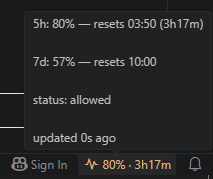

# Claude Usage Stats

[](https://marketplace.visualstudio.com/items?itemName=mmam.claude-usage-stats)
[](https://marketplace.visualstudio.com/items?itemName=mmam.claude-usage-stats)
[](https://marketplace.visualstudio.com/items?itemName=mmam.claude-usage-stats)
[](LICENSE)

A VS Code status bar item showing your **Claude 5-hour plan usage** (official,
color-coded numbers) with a countdown to the next reset. Click it to open the
Claude usage settings page.



The badge reads `$(pulse) N% · Xh YYm` — `N` is 5-hour window utilization, the
countdown is time until that window resets. Hover for the full breakdown:

```
5h: 80% — resets 03:50 (3h17m)

7d: 57% — resets 10:00

status: allowed

updated 0s ago
```

## What it does

- Shows `$(pulse) N% · Xh YYm` in the status bar — 5-hour utilization and the
  countdown until that window resets.
- Color: green below 70%, yellow below 90%, red at/above 90% (or red whenever
  the API reports the window as `rejected`). Thresholds are configurable.
- Tooltip shows the 5-hour and weekly (7-day) percentages, reset times, status,
  and when it last updated.
- Clicking opens `https://claude.ai/new#settings/usage`.

## Status bar states

| Display | Meaning |
| --- | --- |
| `$(pulse) 80% · 3h17m` | Normal. Color shifts green → yellow → red as usage climbs. |
| `$(pulse) 100%` (red) | 5-hour limit reached (`status: rejected`). |
| `$(cloud-offline) 80%` | Offline — showing the last known value. |
| `$(warning) Claude —` | Not logged in, token expired, or API unreachable with no cached value. Hover for the reason. |
| `$(sync~spin) Claude …` | Loading the first reading. |

## How it gets the data

Usage comes from the Anthropic API's `anthropic-ratelimit-unified-*` response
headers — the same numbers shown on the Claude usage page. The extension reads
the OAuth token from `~/.claude/.credentials.json` (written by Claude Code) and
makes a minimal request to read those headers.

**Cost note:** each refresh is one tiny request (Haiku, 1 output token —
negligible), but it does count toward your own 5-hour window. Refreshes happen
every 5 minutes by default and pause while the VS Code window is unfocused.
Overlapping triggers (timer, window focus, manual refresh) collapse into a
single in-flight request, so each cycle bills at most once.

**Token refresh:** the extension does not implement OAuth refresh — it re-reads
`~/.claude/.credentials.json` each poll, so it uses whatever token Claude Code
last wrote. If the token expires and Claude Code has not refreshed it, the item
shows "Token expired — run Claude Code to refresh."

## Requirements

- **Claude Code** installed and logged in. The extension uses its stored
  credentials; it never logs you in or stores a token of its own.
- VS Code `1.85.0` or newer.

## Commands

- **Claude Stats: Refresh** — force an immediate refresh.
- **Claude Stats: Open Usage Page** — open your usage page in the browser.

## Settings

| Setting | Default | Description |
| --- | --- | --- |
| `claudeStats.pollIntervalMinutes` | 5 | Refresh interval in minutes (minimum 1). |
| `claudeStats.pauseWhenUnfocused` | true | Skip scheduled refreshes while VS Code is unfocused. A refresh still fires when you focus the window again. |
| `claudeStats.greenBelow` | 70 | Percent below which the item is green. |
| `claudeStats.yellowBelow` | 90 | Percent below which the item is yellow; at/above it is red. |

## Privacy

No telemetry. The extension only talks to `api.anthropic.com`, using credentials
Claude Code already placed on your machine. Nothing is sent anywhere else, and no
token is stored by this extension.

## License

[MIT](LICENSE)
